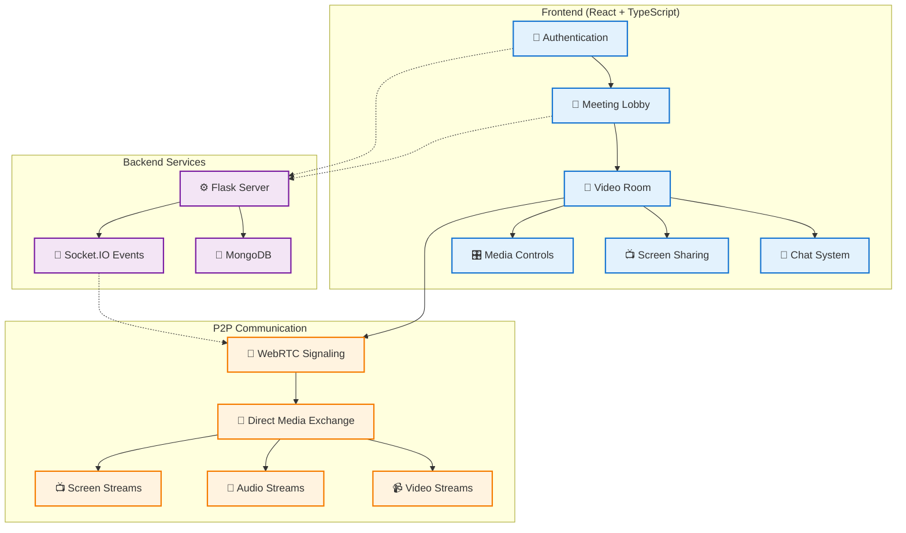
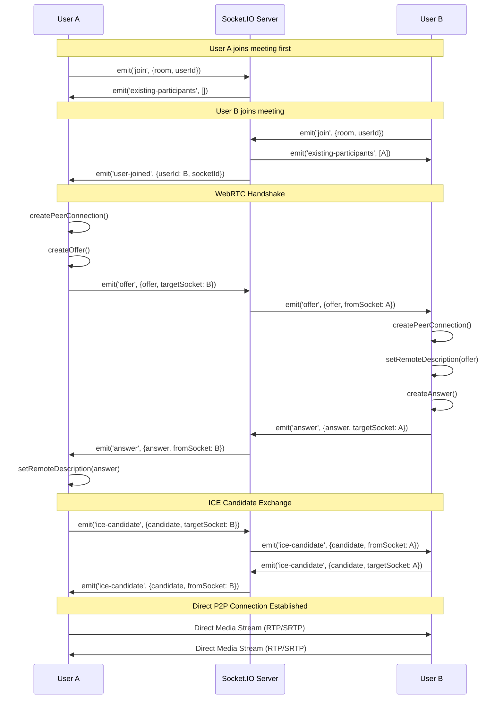

# WebRTC Video Chat Application

A full-featured real-time video conferencing application built with React 19, TypeScript, and WebRTC. This application provides seamless peer-to-peer video communication with advanced features like screen sharing, real-time chat, and robust connection management.

## 🚀 Live Demo

View the live demo at [https://real-time-chat.com](https://real-time-chat.com)

**Key Features:**

- ✅ Real-time video and audio communication
- ✅ Screen sharing with proper mirroring handling
- ✅ Real-time text chat with unread message notifications
- ✅ Meeting management (create, join, leave, end)
- ✅ Audio/video controls (mute/unmute, camera on/off)
- ✅ Participant thumbnails with click-to-focus
- ✅ Connection management with automatic retry
- ✅ Responsive design for desktop and mobile

## 🏗️ Architecture Overview

This application uses a modern, scalable architecture with hook-based React components and WebRTC for peer-to-peer communication.



## WebRTC Signaling Flow



## Key Components Explained

### 1. Authentication & User Management

- Users authenticate through the Auth component
- User data is stored in MongoDB via REST API
- Each user gets a unique userId for session management

### 2. Meeting Management

- **Host**: Creates meeting → Gets meetingId → Joins room
- **Participants**: Join meeting with meetingId → Verify access → Join room
- Meeting state is managed through REST API and Socket.IO

### 3. WebRTC Connection Process

1. **Signaling**: Socket.IO handles offer/answer/ICE candidate exchange
2. **Peer Connections**: Direct RTCPeerConnection between browsers
3. **Media Streams**: Video/audio flows directly P2P (bypasses server)

### 4. Real-time Communication Flow

```
User Action → Socket.IO Event → Server Relay → Other Users → UI Update
```

### 5. Data Flow Architecture

- **Control Data**: REST API ↔ MongoDB (persistent)
- **Real-time Events**: Socket.IO (ephemeral)
- **Media Streams**: Direct P2P WebRTC (real-time)

## Technologies Used

- **Frontend**: React, TypeScript, WebRTC API
- **Backend**: Flask, Socket.IO, MongoDB
- **Real-time**: Socket.IO for signaling, WebRTC for media
- **Infrastructure**: STUN/[TURN](https://www.metered.ca/tools/openrelay/#what-is-a-turn-server) servers for NAT traversal

## System Architecture Deep Dive

### Frontend Architecture (React + TypeScript)

The frontend was redesigned with a modular hook-based architecture to improve maintainability and reduce complexity:

```
src/
├── hooks/                    # Custom React hooks for business logic
│   ├── useAppState.ts       # Centralized application state management
│   ├── useMediaControls.ts  # Media stream controls (audio/video toggle)
│   ├── useMeetingOperations.ts # Meeting lifecycle operations
│   ├── useWebRTCConnection.ts  # WebRTC peer connection management
│   ├── useSocketSetup.ts    # Socket.IO connection setup
│   ├── useSocketEvents.ts   # Socket event listeners management
│   └── useEffects.ts        # Side effects coordination
├── Components/              # React UI components
├── utils/                   # Utility functions
├── Service/                 # API service layer
└── types/                   # TypeScript type definitions
```

#### Hook Responsibilities

1. **useAppState**: Single source of truth for all application state including user data, meeting state, media refs, and UI flags
2. **useWebRTCConnection**: Handles peer connection lifecycle, ICE candidates, and connection timeouts
3. **useSocketEvents**: Manages Socket.IO event listeners with proper cleanup
4. **useMeetingOperations**: Orchestrates meeting join/leave/create operations
5. **useMediaControls**: Controls local media stream (start/stop/toggle audio/video)

### Backend Architecture (Flask + Socket.IO)

```python
# server.py - Main Flask application
├── REST API Endpoints        # User auth, meeting CRUD operations
├── Socket.IO Events          # Real-time signaling for WebRTC
├── MongoDB Integration       # Persistent data storage
└── CORS & Security           # Cross-origin and security headers
```

### Database Schema (MongoDB)

```javascript
// Users Collection
{
  "_id": ObjectId,
  "username": String,
  "displayname": String,
  "created_at": Date
}

// Patrticipants Collection
{
  "_id": ObjectId,
  "meetingId": String,
  "userId": String,
  "joinedAt": Date,
  "isHost": Boolean
}

// Meetings Collection
{
  "_id": ObjectId,
  "name": String,
  "hostId": String,
  "createdAt": Date,
  "active": Boolean,
  "endedAt": Date
}
```

## 🛠️ Technology Stack

### Frontend

- **React 19** - Latest React with concurrent features
- **TypeScript 5.8** - Type-safe development
- **Vite 6.3** - Fast build tool and dev server
- **WebRTC API** - Peer-to-peer media communication
- **Socket.IO Client 4.8** - Real-time event communication

### Backend

- **Flask** - Python web framework
- **Socket.IO** - Real-time bidirectional communication
- **MongoDB** - Document database for user and meeting data
- **Flask-SocketIO** - WebSocket support for Flask

### Infrastructure

- **AWS EC2** - Cloud hosting
- **GitHub Actions** - CI/CD pipeline
- **STUN/TURN Servers** - NAT traversal for WebRTC
- **Nginx** - Reverse proxy and load balancing

## 📁 Project Structure

```
/Real-time/
├── README.md                 # Project documentation
├── nginx.conf               # Nginx configuration
├── Flask-Backend/           # Python backend server
│   ├── server.py           # Main Flask application
│   ├── requirements.txt    # Python dependencies
│   └── wsgi.py            # WSGI entry point
└── webrtc-app/             # React frontend application
    ├── package.json        # Node.js dependencies
    ├── vite.config.ts     # Vite configuration
    ├── tsconfig.json      # TypeScript configuration
    └── src/
        ├── App.tsx         # Main application component
        ├── main.tsx        # Application entry point
        ├── Components/     # React UI components
        │   ├── Auth/           # Authentication components
        │   ├── Chat/           # Chat interface
        │   ├── MeetingLobby/   # Meeting lobby UI
        │   ├── MainVideoComponent.tsx    # Main video display
        │   └── ParticipantThumbnail.tsx  # Participant thumbnails
        ├── hooks/          # Custom React hooks
        │   ├── useAppState.ts          # Centralized state management
        │   ├── useWebRTCConnection.ts  # WebRTC peer connections
        │   ├── useMediaControls.ts     # Media stream controls
        │   ├── useChat.ts              # Chat functionality
        │   ├── useSocketEvents.ts      # Socket event handlers
        │   ├── useMeetingOperations.ts # Meeting lifecycle
        │   ├── useMediaStatusSync.ts   # Media status sync
        │   ├── useSocketSetup.ts       # Socket connection
        │   ├── useConnectionManagement.ts  # Connection management
        │   └── useEffects.ts           # Side effects coordination
        ├── Service/        # API service layer
        │   └── api.ts      # REST API client
        ├── types/          # TypeScript type definitions
        │   └── index.ts    # Application types
        ├── utils/          # Utility functions
        │   ├── mediaUtils.ts   # Media stream utilities
        │   └── webrtcUtils.ts  # WebRTC helper functions
        └── constants/      # Application constants
            └── webrtc.ts   # WebRTC configuration
```

## 🔧 Hook-Based Architecture

The application uses a sophisticated hook-based architecture that separates concerns and improves maintainability:

### Core Hooks

#### `useAppState.ts` - Centralized State Management

```typescript
// Single source of truth for all application state
const {
  userId,
  setUserId,
  username,
  setUsername,
  meetingId,
  setMeetingId,
  participants,
  setParticipants,
  // ... all state variables centralized
} = useAppState();
```

#### `useWebRTCConnection.ts` - WebRTC Management

- Creates and manages peer connections
- Handles ICE candidate exchange
- Implements connection timeout and retry logic
- Manages peer connection lifecycle

#### `useMediaControls.ts` - Media Stream Controls

- Audio/video toggle functionality
- **Screen sharing with proper mirroring handling**
- Camera switching and media device management
- Stream replacement for screen sharing

#### `useChat.ts` - Real-time Chat

- Send and receive chat messages
- Unread message notifications
- Message history management
- Socket-based real-time messaging

#### `useSocketEvents.ts` - Event Management

- Socket.IO event listener setup
- Proper event cleanup to prevent memory leaks
- Event handler registration and deregistration

#### `useMeetingOperations.ts` - Meeting Lifecycle

- Join/leave meeting operations
- Meeting creation and validation
- Participant management
- Meeting cleanup on exit

### Key Features Implementation

#### Screen Sharing with Mirroring Fix

The application correctly handles video mirroring for different stream types:

```typescript
// ParticipantThumbnail.tsx - Conditional mirroring
transform: isLocal && !isScreenSharing ? "scaleX(-1)" : "none"

// MainVideoComponent.tsx - Screen sharing detection
style={{ transform: isScreenSharing ? "none" : "scaleX(-1)" }}
```

**Problem Solved**: Screen sharing content was appearing mirrored due to CSS transforms intended for camera video. The fix conditionally applies mirroring only for camera streams, not screen shares.

#### Real-time Chat System

- Text messaging during video calls
- Unread message badges
- Persistent chat history during session
- Socket.IO based real-time delivery

#### Connection Management

- Automatic connection retry with exponential backoff
- Connection timeout handling (10-second default)
- Graceful fallback for failed connections
- Comprehensive connection state monitoring

## ⚡ Performance Optimizations

### React Performance

- **Memoized callbacks** prevent unnecessary re-renders
- **useRef** for values that don't trigger renders
- **Centralized state** reduces prop drilling
- **Event cleanup** prevents memory leaks

### WebRTC Optimizations

- **Connection pooling** reuses peer connections
- **ICE candidate buffering** handles timing issues
- **Automatic retry** with exponential backoff
- **Connection timeout** management (10s default)

### Real-time Features

- **Efficient Socket.IO** event management
- **Media stream optimization** for screen sharing
- **Chat message batching** for better performance
- **Participant state synchronization**

## 🔧 Advanced Features

### Screen Sharing Implementation

```typescript
// Conditional mirroring for different stream types
const videoStyle = {
  transform: isScreenSharing ? "none" : "scaleX(-1)",
};
```

### Chat System

- Real-time messaging with Socket.IO
- Unread message notifications
- Message persistence during session
- Emoji and text support

### Connection Management

- Automatic reconnection on network issues
- Connection quality monitoring
- Graceful degradation for poor connections
- Comprehensive error handling

## 🐛 Troubleshooting

### Common Issues

1. **Camera/Microphone Not Working**

   - Ensure HTTPS is enabled (required for WebRTC)
   - Check browser permissions for media access
   - Verify media devices are not in use by other applications

2. **Connection Failures**

   - Check STUN/TURN server configuration
   - Verify firewall settings allow WebRTC traffic
   - Ensure both users are on the same meeting ID

3. **Screen Sharing Issues**

   - Update to latest browser version
   - Check screen sharing permissions
   - Verify the mirroring fix is applied correctly

4. **Chat Not Working**
   - Check Socket.IO connection status
   - Verify meetingId and userId are set
   - Check console for JavaScript errors

### Debug Mode

Enable debug logging by setting:

```javascript
localStorage.setItem("debug", "webrtc:*");
```

## 🧪 Testing

### Manual Testing Checklist

- [ ] User authentication
- [ ] Meeting creation and joining
- [ ] Video/audio streaming
- [ ] Screen sharing functionality
- [ ] Chat messaging
- [ ] Media controls (mute/unmute)
- [ ] Connection handling
- [ ] Mobile responsiveness

### Performance Testing

- Test with multiple participants (2-6 users)
- Monitor CPU and memory usage
- Check network bandwidth consumption
- Verify connection stability over time

## 🔮 Future Enhancements

### Planned Features

- [ ] **Mobile App** - React Native implementation
- [ ] **Recording** - Session recording and playback
- [ ] **File Sharing** - Document sharing during meetings
- [ ] **Virtual Backgrounds** - AI-powered background replacement
- [ ] **Breakout Rooms** - Split participants into smaller groups
- [ ] **Meeting Analytics** - Usage statistics and insights

### Technical Improvements

- [ ] **SFU Architecture** - Support for larger meetings (10+ participants)
- [ ] **Adaptive Bitrate** - Dynamic quality adjustment
- [ ] **End-to-End Encryption** - Enhanced security
- [ ] **PWA Support** - Progressive Web App features
- [ ] **Internationalization** - Multi-language support

## 📝 API Documentation

### REST Endpoints

```
POST /api/users/register     # User registration
POST /api/users/login        # User authentication
POST /api/meetings           # Create meeting
POST /api/meetings/join      # Join meeting
DELETE /api/meetings/:id     # End meeting
```

### Socket.IO Events

```
join                    # Join meeting room
user-joined            # New participant notification
user-left              # Participant left notification
offer                  # WebRTC offer
answer                 # WebRTC answer
ice-candidate          # ICE candidate exchange
media-status-changed   # Audio/video/screen sharing status
chat-message           # Text chat message
meeting-ended          # Meeting termination
```

## 🤝 Contributing

1. Fork the repository
2. Create a feature branch: `git checkout -b feature/amazing-feature`
3. Commit changes: `git commit -m 'Add amazing feature'`
4. Push to branch: `git push origin feature/amazing-feature`
5. Open a Pull Request

### Development Guidelines

- Follow TypeScript best practices
- Write comprehensive tests
- Update documentation for new features
- Ensure backward compatibility
- Follow the existing code style

## 📄 License

This project is licensed under the MIT License - see the [LICENSE](LICENSE) file for details.

## 🙋‍♂️ Support

For questions and support:

- Create an issue on GitHub
- Check the troubleshooting section
- Review the API documentation

---

**Built with ❤️ using React 19, TypeScript, and WebRTC**
