# WebRTC Video Chat Architecture

## System Overview

```mermaid
flowchart TD
    %% Main Components
    User["👤 User"]
    Browser["🌐 Browser"]
    Server["⚙️ Socket.IO Server"]
    Database["💾 MongoDB"]

    %% Application Flow
    subgraph "User Journey"
        Auth["🔑 Authentication"]
        Create["📝 Create Meeting"]
        Join["🚪 Join Meeting"]
        Connect["🔌 Establish WebRTC"]
        Stream["📹 Stream Media"]
        End["❌ End Meeting"]
    end

    subgraph "WebRTC Flow"
        LocalMedia["📹 Get Local Media"]
        Signaling["📡 Signaling"]
        PeerConn["🔄 Create Peer Connection"]
        ICE["❄️ ICE Candidates Exchange"]
        P2P["👥 P2P Connection"]
    end

    subgraph "Media Exchange"
        direction LR
        UserA["👤 User A"] <--"Direct P2P"--> UserB["👤 User B"]
        UserA <--"Direct P2P"--> UserC["👤 User C"]
        UserB <--"Direct P2P"--> UserC
    end

    %% Main Flow
    User --> Auth
    Auth -- "API Call" --> Database
    Auth --> Create
    Auth --> Join
    Create -- "Generate meetingId" --> Database
    Join -- "Validate meetingId" --> Database
    Create --> Connect
    Join --> Connect
    Connect --> Stream
    Stream --> End
    End -- "Cleanup" --> Database

    %% WebRTC Detail Flow
    Connect --> LocalMedia
    LocalMedia --> Signaling
    Signaling -- "Socket.IO" --> Server
    Server -- "Relay" --> Signaling
    Signaling --> PeerConn
    PeerConn --> ICE
    ICE -- "Socket.IO" --> Server
    ICE --> P2P
    P2P --> Stream

    %% Styles
    classDef browser fill:#e1f5fe,stroke:#0277bd,stroke-width:2px
    classDef server fill:#f3e5f5,stroke:#7b1fa2,stroke-width:2px
    classDef db fill:#ffebee,stroke:#c62828,stroke-width:2px
    classDef media fill:#fff9c4,stroke:#fbc02d,stroke-width:2px

    class Browser browser
    class Server server
    class Database db
    class Stream,LocalMedia,P2P media
```



## WebRTC Signaling Flow


## Key Components Explained

### 1. Authentication & User Management

- Users authenticate through the Auth component
- User data is stored in MongoDB via REST API
- Each user gets a unique userId for session management

### 2. Meeting Management

- **Host**: Creates meeting → Gets meetingId → Joins room
- **Participants**: Join meeting with meetingId → Verify access → Join room
- Meeting state is managed through REST API and Socket.IO

### 3. WebRTC Connection Process

1. **Signaling**: Socket.IO handles offer/answer/ICE candidate exchange
2. **Peer Connections**: Direct RTCPeerConnection between browsers
3. **Media Streams**: Video/audio flows directly P2P (bypasses server)

### 4. Real-time Communication Flow

```
User Action → Socket.IO Event → Server Relay → Other Users → UI Update
```

### 5. Data Flow Architecture

- **Control Data**: REST API ↔ MongoDB (persistent)
- **Real-time Events**: Socket.IO (ephemeral)
- **Media Streams**: Direct P2P WebRTC (real-time)

## Technologies Used

- **Frontend**: React, TypeScript, WebRTC API
- **Backend**: Flask, Socket.IO, MongoDB
- **Real-time**: Socket.IO for signaling, WebRTC for media
- **Infrastructure**: STUN/[TURN](https://www.metered.ca/tools/openrelay/#what-is-a-turn-server) servers for NAT traversal
