# WebRTC Video Chat Application

# Live Demo

This is a small meeting app implemented Real-time video communication using webRTC and socker-io.

Currently this application is deployed on AWS EC2 with Github Action for CI/CD pipeline.

View the demo [here](https://real-time-chat.com)

## System Overview

```mermaid
flowchart TD
    %% Main Components
    User["👤 User"]
    Browser["🌐 Browser"]
    Server["⚙️ Socket.IO Server"]
    Database["💾 MongoDB"]

    %% Application Flow
    subgraph "User"
        Auth["🔑 Authentication"]
        Create["📝 Create Meeting"]
        Join["🚪 Join Meeting"]
        Connect["🔌 Establish WebRTC"]
        Stream["📹 Stream Media"]
        End["❌ End Meeting"]
    end

    subgraph "WebRTC Flow"
        LocalMedia["📹 Get Local Media"]
        Signaling["📡 Signaling"]
        PeerConn["🔄 Create Peer Connection"]
        ICE["❄️ ICE Candidates Exchange"]
        P2P["👥 P2P Connection"]
    end

    subgraph "Media Exchange"
        direction LR
        UserA["👤 User A"] <--"Direct P2P"--> UserB["👤 User B"]
        UserA <--"Direct P2P"--> UserC["👤 User C"]
        UserB <--"Direct P2P"--> UserC
    end

    %% Main Flow
    User --> Auth
    Auth -- "API Call" --> Database
    Auth --> Create
    Auth --> Join
    Create -- "Generate meetingId" --> Database
    Join -- "Validate meetingId" --> Database
    Create --> Connect
    Join --> Connect
    Connect --> Stream
    Stream --> End
    End -- "Cleanup" --> Database

    %% WebRTC Detail Flow
    Connect --> LocalMedia
    LocalMedia --> Signaling
    Signaling -- "Socket.IO" --> Server
    Server -- "Relay" --> Signaling
    Signaling --> PeerConn
    PeerConn --> ICE
    ICE -- "Socket.IO" --> Server
    ICE --> P2P
    P2P --> Stream

    %% Styles
    classDef browser fill:#e1f5fe,stroke:#0277bd,stroke-width:2px
    classDef server fill:#f3e5f5,stroke:#7b1fa2,stroke-width:2px
    classDef db fill:#ffebee,stroke:#c62828,stroke-width:2px
    classDef media fill:#fff9c4,stroke:#fbc02d,stroke-width:2px

    class Browser browser
    class Server server
    class Database db
    class Stream,LocalMedia,P2P media
```



## WebRTC Signaling Flow


## Key Components Explained

### 1. Authentication & User Management

- Users authenticate through the Auth component
- User data is stored in MongoDB via REST API
- Each user gets a unique userId for session management

### 2. Meeting Management

- **Host**: Creates meeting → Gets meetingId → Joins room
- **Participants**: Join meeting with meetingId → Verify access → Join room
- Meeting state is managed through REST API and Socket.IO

### 3. WebRTC Connection Process

1. **Signaling**: Socket.IO handles offer/answer/ICE candidate exchange
2. **Peer Connections**: Direct RTCPeerConnection between browsers
3. **Media Streams**: Video/audio flows directly P2P (bypasses server)

### 4. Real-time Communication Flow

```
User Action → Socket.IO Event → Server Relay → Other Users → UI Update
```

### 5. Data Flow Architecture

- **Control Data**: REST API ↔ MongoDB (persistent)
- **Real-time Events**: Socket.IO (ephemeral)
- **Media Streams**: Direct P2P WebRTC (real-time)

## Technologies Used

- **Frontend**: React, TypeScript, WebRTC API
- **Backend**: Flask, Socket.IO, MongoDB
- **Real-time**: Socket.IO for signaling, WebRTC for media
- **Infrastructure**: STUN/[TURN](https://www.metered.ca/tools/openrelay/#what-is-a-turn-server) servers for NAT traversal

## System Architecture Deep Dive

### Frontend Architecture (React + TypeScript)

The frontend was redesigned with a modular hook-based architecture to improve maintainability and reduce complexity:

```
src/
├── hooks/                    # Custom React hooks for business logic
│   ├── useAppState.ts       # Centralized application state management
│   ├── useMediaControls.ts  # Media stream controls (audio/video toggle)
│   ├── useMeetingOperations.ts # Meeting lifecycle operations
│   ├── useWebRTCConnection.ts  # WebRTC peer connection management
│   ├── useSocketSetup.ts    # Socket.IO connection setup
│   ├── useSocketEvents.ts   # Socket event listeners management
│   └── useEffects.ts        # Side effects coordination
├── Components/              # React UI components
├── utils/                   # Utility functions
├── Service/                 # API service layer
└── types/                   # TypeScript type definitions
```

#### Hook Responsibilities

1. **useAppState**: Single source of truth for all application state including user data, meeting state, media refs, and UI flags
2. **useWebRTCConnection**: Handles peer connection lifecycle, ICE candidates, and connection timeouts
3. **useSocketEvents**: Manages Socket.IO event listeners with proper cleanup
4. **useMeetingOperations**: Orchestrates meeting join/leave/create operations
5. **useMediaControls**: Controls local media stream (start/stop/toggle audio/video)

### Backend Architecture (Flask + Socket.IO)

```python
# server.py - Main Flask application
├── REST API Endpoints        # User auth, meeting CRUD operations
├── Socket.IO Events          # Real-time signaling for WebRTC
├── MongoDB Integration       # Persistent data storage
└── CORS & Security           # Cross-origin and security headers
```

### Database Schema (MongoDB)

```javascript
// Users Collection
{
  "_id": ObjectId,
  "username": String,
  "email": String,
  "created_at": Date
}

// Meetings Collection
{
  "_id": ObjectId,
  "meetingId": String,        // Unique meeting identifier
  "hostId": String,           // User ID of meeting host
  "participants": [String],   // Array of participant user IDs
  "created_at": Date,
  "ended_at": Date,
  "status": String            // "active" | "ended"
}
```

## Technical Trade-offs & Design Decisions

### 1. **Mesh vs SFU Architecture**

**Decision**: Chose Mesh (P2P) topology over SFU (Selective Forwarding Unit)

**Trade-offs**:

- ✅ **Pros**: Lower server costs, reduced latency, better privacy (no media through server)
- ❌ **Cons**: Limited scalability (~4-6 participants max), higher client bandwidth usage
- **Reasoning**: For small team meetings, mesh topology provides better performance and lower infrastructure costs

### 2. **Socket.IO vs Native WebSockets**

**Decision**: Used Socket.IO for signaling

**Trade-offs**:

- ✅ **Pros**: Auto-reconnection, fallback transports, event-based API, room management
- ❌ **Cons**: Larger bundle size, additional abstraction layer
- **Reasoning**: Socket.IO's reliability features are crucial for signaling in unstable networks

### 3. **React Hooks vs Redux**

**Decision**: Custom hooks with useState/useRef over Redux

**Trade-offs**:

- ✅ **Pros**: Simpler state management, better performance, less boilerplate
- ❌ **Cons**: No time-travel debugging, harder to share state across distant components
- **Reasoning**: WebRTC state is mostly local and ephemeral, doesn't benefit from Redux complexity

### 4. **TypeScript vs JavaScript**

**Decision**: Full TypeScript implementation

**Trade-offs**:

- ✅ **Pros**: Better IDE support, compile-time error catching, self-documenting APIs
- ❌ **Cons**: Steeper learning curve, longer initial development time
- **Reasoning**: WebRTC APIs are complex and type safety prevents runtime errors

## Major Technical Challenges & Solutions

### 1. **Race Conditions in WebRTC Signaling**

**Challenge**: Multiple simultaneous offer/answer exchanges causing connection failures

**Problem Symptoms**:

```javascript
// Race condition when users join simultaneously
User A creates offer → User B creates offer → Both get confused about remote descriptions
```

**Solution Implemented**:

```typescript
// Connection timeout and retry mechanism
const CONNECTION_TIMEOUT = 10000; // 10 seconds

const handleConnectionTimeout = useCallback(
  async (participantSocketId: string) => {
    console.log(
      `Connection timeout for ${participantSocketId}, attempting reconnect`
    );

    // Clear existing connection
    const pc = peerConnections.current.get(participantSocketId);
    if (pc) {
      pc.close();
      peerConnections.current.delete(participantSocketId);
    }

    // Wait before recreating to avoid immediate retry loops
    await new Promise((resolve) => setTimeout(resolve, 1000));

    // Recreate connection with exponential backoff
    await recreateConnection(participantSocketId);
  },
  []
);
```

**Key Strategies**:

- Connection timeouts with automatic retry
- Exponential backoff for failed connections
- Proper cleanup of failed peer connections
- State synchronization between signaling and connection state

### 2. **Memory Leaks in Media Streams**

**Challenge**: MediaStream tracks not being properly cleaned up causing browser resource leaks

**Solution**:

```typescript
const cleanupMediaTracks = (stream: MediaStream | null) => {
  if (stream) {
    stream.getTracks().forEach((track) => {
      track.stop();
      stream.removeTrack(track);
    });
  }
};

// Proper cleanup in useEffect
useEffect(() => {
  return () => {
    cleanupMediaTracks(localStreamRef.current);
    // Clear all video elements
    if (localVideo.current) {
      localVideo.current.srcObject = null;
    }
  };
}, []);
```

### 3. **Socket.IO Connection State Management**

**Challenge**: Handling disconnections, reconnections, and duplicate event listeners

**Solution**:

```typescript
// Robust socket event management
useEffect(() => {
  if (!socketRef.current) return;

  const socket = socketRef.current;

  // Register event listeners
  socket.on("user-joined", onUserJoined);
  socket.on("user-left", onUserLeft);
  socket.on("offer", onOffer);

  // Critical: Clean up listeners to prevent duplicates
  return () => {
    socket.off("user-joined", onUserJoined);
    socket.off("user-left", onUserLeft);
    socket.off("offer", onOffer);
  };
}, [socketRef, onUserJoined, onUserLeft, onOffer]); // Dependencies ensure fresh handlers
```

### 4. **ICE Candidate Buffering**

**Challenge**: ICE candidates arriving before remote description is set

**Solution**:

```typescript
// Buffer ICE candidates until peer connection is ready
const pendingICECandidates = useRef<Map<string, RTCIceCandidate[]>>(new Map());

const handleIceCandidate = useCallback(async (data) => {
  const pc = peerConnections.current.get(data.fromSocket);

  if (!pc || pc.remoteDescription === null) {
    // Buffer candidates if peer connection not ready
    const pending = pendingICECandidates.current.get(data.fromSocket) || [];
    pending.push(new RTCIceCandidate(data.candidate));
    pendingICECandidates.current.set(data.fromSocket, pending);
    return;
  }

  // Add candidate immediately if ready
  await pc.addIceCandidate(new RTCIceCandidate(data.candidate));
}, []);
```

### 5. **State Synchronization Across Hooks**

**Challenge**: Multiple hooks managing related state leading to inconsistencies

**Original Problem**:

```typescript
// State scattered across multiple hooks
const [userId, setUserId] = useState(null); // In App.tsx
const [meetingId, setMeetingId] = useState(null); // In App.tsx
const [inRoom, setInRoom] = useState(false); // In App.tsx
// ... many more state variables
```

**Solution - Centralized State Management**:

```typescript
// useAppState.ts - Single source of truth
export const useAppState = () => {
  const [userId, setUserId] = useState<string | null>(null);
  const [username, setUsername] = useState<string | null>(null);
  const [meetingId, setMeetingId] = useState<string | null>(null);
  const [participants, setParticipants] = useState<Participant[]>([]);
  // ... all state in one place

  return {
    userId,
    setUserId,
    username,
    setUsername,
    meetingId,
    setMeetingId,
    participants,
    setParticipants,
    // ... centralized state management
  };
};
```

## Performance Optimizations

### 1. **React Rendering Optimization**

```typescript
// Memoized callbacks to prevent unnecessary re-renders
const handleUserJoined = useCallback(
  (data) => {
    // Implementation
  },
  [dependency1, dependency2]
);

// Refs for values that don't trigger re-renders
const peerConnections = useRef<Map<string, RTCPeerConnection>>(new Map());
const connectionStartTimes = useRef<Map<string, number>>(new Map());
```

### 2. **WebRTC Connection Pooling**

```typescript
// Reuse peer connections when possible
const getOrCreatePeerConnection = useCallback((participantSocketId: string) => {
  let pc = peerConnections.current.get(participantSocketId);

  if (!pc || pc.connectionState === "closed") {
    pc = createPeerConnection(participantSocketId);
    peerConnections.current.set(participantSocketId, pc);
  }

  return pc;
}, []);
```

### 3. **Efficient Event Cleanup**

```typescript
// Automatic cleanup prevents memory leaks
const cleanupConnections = useCallback(() => {
  // Clear all connection timeouts
  connectionTimeouts.forEach((timeout) => clearTimeout(timeout));
  setConnectionTimeouts(new Map());
  connectionStartTimes.current.clear();

  // Close all peer connections
  peerConnections.current.forEach((pc) => pc.close());
  peerConnections.current.clear();
}, [connectionTimeouts]);
```

## Testing & Debugging Strategies

### 1. **Connection State Monitoring**

```typescript
// Comprehensive logging for debugging
const logConnectionState = (participantId: string, pc: RTCPeerConnection) => {
  console.log(`Connection state for ${participantId}:`, {
    connectionState: pc.connectionState,
    iceConnectionState: pc.iceConnectionState,
    iceGatheringState: pc.iceGatheringState,
    signalingState: pc.signalingState,
  });
};
```

### 2. **Error Boundary Implementation**

```typescript
// Graceful error handling
const handleWebRTCError = (error: Error, context: string) => {
  console.error(`WebRTC Error in ${context}:`, error);

  // Attempt automatic recovery
  if (error.name === "InvalidStateError") {
    // Recreate connection
    recreateConnection(participantId);
  }
};
```

## Deployment & Infrastructure

### Production Considerations

1. **STUN/TURN Servers**: Essential for NAT traversal in production
2. **SSL Certificates**: Required for WebRTC getUserMedia() API
3. **Load Balancing**: Socket.IO sticky sessions for proper signaling
4. **Error Monitoring**: Comprehensive logging for WebRTC connection issues

### Environment Configuration

```javascript
// Different configurations for dev/prod
const STUN_SERVERS = {
  development: ["stun:stun.l.google.com:19302"],
  production: [
    "stun:stun.l.google.com:19302",
    "turn:your-turn-server.com:3478",
  ],
};
```

## Future Improvements

1. **Scalability**: Implement SFU architecture for larger meetings
2. **Mobile Support**: Optimize for mobile browsers and responsive design
3. **Screen Sharing**: Add screen sharing capabilities
4. **Recording**: Server-side recording functionality
5. **Chat**: Text chat during meetings
6. **Network Adaptation**: Dynamic quality adjustment based on network conditions

## Getting Started

### Prerequisites

- Node.js 18+
- Python 3.9+
- MongoDB 5.0+

### Installation

```bash
# Backend setup
cd Flask-Backend
pip install -r requirements.txt
python server.py

# Frontend setup
cd webrtc-app
npm install
npm run dev
```

### Environment Variables

```bash
# Backend (.env)
MONGO_URI=mongodb://localhost:27017/webrtc_app
FLASK_ENV=development

# Frontend (.env)
VITE_API_BASE_URL=http://localhost:5000
VITE_SOCKET_URL=http://localhost:5000
```

This WebRTC application demonstrates real-world challenges in building peer-to-peer communication systems and provides practical solutions for common issues like race conditions, memory management, and state synchronization in React applications.
